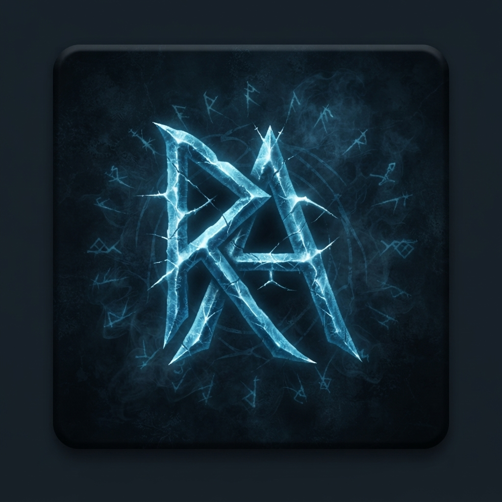

# PoE2 Grand Expedition Rune Tracker

<p align="center">
  
</p>

A small Windows overlay that remembers which Aldur Runes carry forward during
Path of Exile 2 Grand Expeditions. It records your choices and warns when the
hovered slot is not passable. It does not recommend which rune to choose.

## Download

**[Download the latest Windows release](https://github.com/sirawitbm/aldur-rune-tracker/releases/latest)**

On the release page, download the file named like
`PoE2RuneTracker-v0.1.1-windows-x64.zip`. Do not download GitHub's automatically
generated "Source code" ZIP unless you want to run the Python source.

1. Download the portable ZIP and its matching `.sha256` file.
2. Scan the ZIP with Microsoft Defender.
3. Extract the entire ZIP to a folder.
4. Open `PoE2RuneTracker.exe`. Keep the `_internal` folder beside it.

No installer, administrator access, or Python installation is required. To
uninstall, quit the tray app and delete its folder.

### Optional checksum verification

Open PowerShell in your Downloads folder and run:

```powershell
$actual = (Get-FileHash .\PoE2RuneTracker-v0.1.1-windows-x64.zip -Algorithm SHA256).Hash
$expected = ((Get-Content .\PoE2RuneTracker-v0.1.1-windows-x64.zip.sha256) -split '\s+')[0]
$actual -eq $expected
```

The result must be `True`.

## Basic use

1. Start the tracker before entering a Grand Expedition.
2. Hover the rune slot you plan to pick and keep its full tooltip visible.
3. Press `Ctrl+3`.
4. Confirm the toast. A passable rune appears in the on-screen list; a
   non-passable rune is rejected.
5. If the tracker asks which rune it sees, select the correct name from the
   popup.

| Shortcut | Action |
| --- | --- |
| `Ctrl+3` | Capture the hovered rune |
| `Ctrl+4` | Undo the most recently tracked rune |
| `Ctrl+Shift+4` | Reset the tracker |
| `Ctrl+5` | Hide or restore every tracker window |
| `Ctrl+Shift+5` | Hide or restore only the control panel |

Right-click or double-click the notification-area icon to open **Settings**.
Hotkeys, overlay size, and capture timing can be changed there without
restarting the app.

The rune list is click-through while locked. Use **Unlock rune list to move
it** in the control panel before dragging it or removing an older entry, then
lock it again for gameplay. Use **Reset tracker** when beginning a new chain.

## Common problems

### I opened the app but cannot see it

Check the Windows notification-area overflow menu for the RA icon. Only one
copy can run at a time. Press `Ctrl+5` in case the tracker windows are hidden.

### Windows says the app is unrecognized

The project does not yet have a commercial code-signing certificate, so
SmartScreen may warn about a new release. Do not disable security software.
Download only from this repository, verify the checksum, and scan the archive.
Build from source if you are not comfortable running an unsigned executable.

### The executable will not start after extracting

Make sure you extracted the whole ZIP instead of moving only the `.exe`. The
`_internal` folder must remain next to `PoE2RuneTracker.exe`. Check whether
Defender quarantined a file and use the release checksum to verify the download.

### A hotkey does nothing

Open **Settings** from the tray and choose a shortcut that does not conflict
with PoE or another overlay. If PoE is running as administrator, Windows may
prevent a normal application from receiving the same input; running both at the
same privilege level avoids that mismatch.

### A passable rune is rejected or identified incorrectly

Keep the full tooltip visible for a moment before pressing `Ctrl+3`. Undo a bad
entry with `Ctrl+4` and capture again. If the tooltip updates slowly, increase
**Capture delay** in Settings. Use the selection popup whenever the image and
text signals disagree.

### The overlay is off-screen or in the wrong place

Unlock and drag it from the control panel. If it cannot be recovered, quit the
app, delete `data/positions.json` beside the executable, and restart.

## Privacy and safety

- The runtime makes no network requests.
- Screenshots, settings, history, and learned recognition data stay in the
  portable app folder.
- Accuracy-calibration screenshots are disabled by default because nearby UI
  or chat can appear in them.
- The official release builder excludes all developer runtime data from the
  downloadable ZIP.

Before attaching diagnostic images to a public issue, inspect them for chat or
other personal information.

## More information

- [Technical documentation](TECHNICAL.md): recognition design, configuration,
  building, release automation, testing, and contributor workflow.
- [Releases](https://github.com/sirawitbm/aldur-rune-tracker/releases)
- [Report a problem](https://github.com/sirawitbm/aldur-rune-tracker/issues)

This is an unofficial community tool and is not affiliated with or endorsed by
Grinding Gear Games.

## License

Original source code is available under the [MIT License](LICENSE). Path of
Exile names, game data, and third-party icon assets remain the property of their
respective owners and are not relicensed by this repository.
